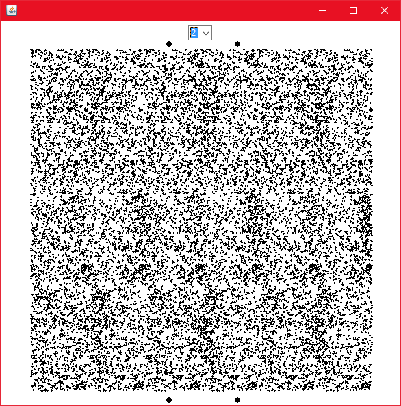

# RandomDotStereogram
RDS-Program例,CGSTEREOGRAM(1992)小学館

Porting N88BASIC to Java.

##Environment
>java -version
java version "1.8.0_181"
Java(TM) SE Runtime Environment (build 1.8.0_181-b13)
Java HotSpot(TM) 64-Bit Server VM (build 25.181-b13, mixed mode)
>javac -version
javac 1.8.0_181

##Compile
javac RDS.java

##Run
java RDS

